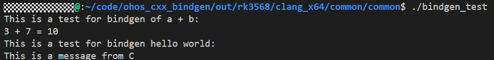

[](https://crates.io/crates/bindgen)
[](https://docs.rs/bindgen/)

## 引入背景

`bindgen` 自动生成Rust与C（和一些C++）库的FFI绑定。

例如，给定C头文件`doggo.h`：

```c
typedef struct Doggo {
    int many;
    char wow;
} Doggo;

void eleven_out_of_ten_majestic_af(Doggo* pupper);
```

`bindgen`产生Rust FFI代码，允许调用`doggo`库的函数并使用其类型：

```rust
/* automatically generated by rust-bindgen 0.99.9 */

#[repr(C)]
pub struct Doggo {
    pub many: ::std::os::raw::c_int,
    pub wow: ::std::os::raw::c_char,
}

extern "C" {
    pub fn eleven_out_of_ten_majestic_af(pupper: *mut Doggo);
}
```

## 目录结构
bindgen的目录树结构如下：
```
.
├── appveyor.yml
├── bindgen
│   ├── BUILD.gn
│   ├── build.rs
│   ├── callbacks.rs
│   ├── Cargo.toml
│   ├── codegen
│   ├── deps.rs
│   ├── extra_assertions.rs
│   ├── features.rs
│   ├── ir
│   ├── lib.rs
│   ├── LICENSE -> ../LICENSE
│   ├── log_stubs.rs
│   ├── parse.rs
│   ├── regex_set.rs
│   └── time.rs
├── bindgen-cli
│   ├── BUILD.gn
│   ├── Cargo.toml
│   ├── LICENSE -> ../LICENSE
│   ├── main.rs
│   └── options.rs
├── bindgen-integration
│   ├── build.rs
│   ├── Cargo.toml
│   ├── cpp
│   ├── include
│   └── src
├── bindgen-tests
│   ├── build.rs
│   ├── Cargo.toml
│   ├── src
│   └── tests
├── book
│   ├── book.toml
│   └── src
├── Cargo.lock
├── Cargo.toml
├── CHANGELOG.md
├── ci
│   ├── assert-no-diff.bat
│   ├── no-includes.sh
│   ├── test.bat
│   └── test.sh
├── CONTRIBUTING.md
├── csmith-fuzzing
│   ├── csmith.h
│   ├── driver.py
│   ├── predicate.py
│   └── README.md
├── example-graphviz-ir.png
├── LICENSE
├── OAT.xml
├── README.md
├── README.OpenSource
├── README_zh.md
├── releases
│   ├── friends.sh
│   └── release-announcement-template.md
└── rustfmt.toml
```

## Bindgen工具在OH上的使用指导

### 操作步骤
下面是一个使用bindgen实现Rust调用C的示例。

1. 在C代码侧，使用头文件lib.h定义两个接口，接口FuncAAddB用来实现两数求和，接口SayHello用来打印字符串。

   ```c
   #ifndef BUILD_RUST_TESTS_BINDGEN_TEST_LIB_H_
   #define BUILD_RUST_TESTS_BINDGEN_TEST_LIB_H_
   #include <stdint.h>
   #include "build/rust/tests/test_bindgen_test/test_for_hello_world/lib2.h"
   
   uint32_t FuncAAddB(uint32_t a, uint32_t b);
   void SayHello(const char *message);
   
   #endif  //  BUILD_RUST_TESTS_BINDGEN_TEST_LIB_H_
   ```


2. 在lib.c中添加对两个接口的对应实现。

   ```c
   #include "build/rust/tests/test_bindgen_test/test_for_hello_world/lib.h"
   #include <stdint.h>
   #include <stdio.h>

   void SayHello(const char *message)
   {
       printf("This is a test for bindgen hello world:\n");
       printf("%s\n", message);
   }

   uint32_t FuncAAddB(uint32_t a, uint32_t b)
   {
       printf("This is a test for bindgen of a + b:\n");
       return a + b;
   }
   ```

3. 添加文件main.rs，就可以在Rust侧通过c_ffi实现对C侧的接口调用。注意Rust侧调用的不安全接口需要使用unsafe封装。

   ```rust
   //!  bindgen test for hello world
   #![allow(clippy::approx_constant)]
   mod c_ffi {
       #![allow(dead_code)]
       #![allow(non_upper_case_globals)]
       #![allow(non_camel_case_types)]
       include!(env!("BINDGEN_RS_FILE"));
   }
   /// pub fn add_two_numbers_in_c
   pub fn add_two_numbers_in_c(a: u32, b: u32) -> u32 {
       unsafe { c_ffi::FuncAAddB(a, b) }
   }

   use std::ffi::c_char;
   use std::ffi::CString;

   /// fn main()
   fn main() {
       println!("{} + {} = {}", 3, 7, add_two_numbers_in_c(3, 7));
       let c_str = CString::new("This is a message from C").unwrap();
       let c_world: *const c_char = c_str.as_ptr() as *const c_char;
       unsafe {
           c_ffi::SayHello(c_world);
       }
   }

   ```

4. 添加构建文件BUILD.gn，建立Rust模块对C模块的依赖。

   ```GN
   import("//build/ohos.gni")

   ohos_shared_library("c_lib") {
     sources = [ "lib.c" ]
     defines = [ "COMPONENT_IMPLEMENTATION" ]
   }

   rust_bindgen("c_lib_bindgen") {
     header = "lib.h"
   }

   ohos_rust_executable("bindgen_test") {
     deps = [ ":c_lib" ]
     deps += [ ":c_lib_bindgen" ]
     sources = [ "main.rs" ]
     bindgen_output = get_target_outputs(":c_lib_bindgen")
     inputs = bindgen_output
     rustenv = [ "BINDGEN_RS_FILE=" + rebase_path(bindgen_output[0]) ]
     crate_root = "main.rs"
   }
   ```

**调测验证**



## MSRV

Minimum support Rust版本是**1.60.0**。

目前还没有制定MSRV提升政策，所以MSRV可能会在任何版本中增加。

MSRV是可用于编译`bindgen`的Minimum Rust版本。`bindgen`可以生成与低于当前MSRV的Rust版本兼容的绑定。

## API参考

[API参考文档在docs.rs上](https://docs.rs/bindgen)

## 开发者贡献

在使用该工具的过程中有任何问题欢迎开发者在社区issue中反馈。

<br>


